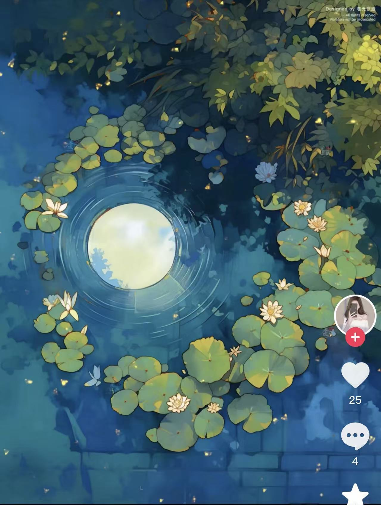
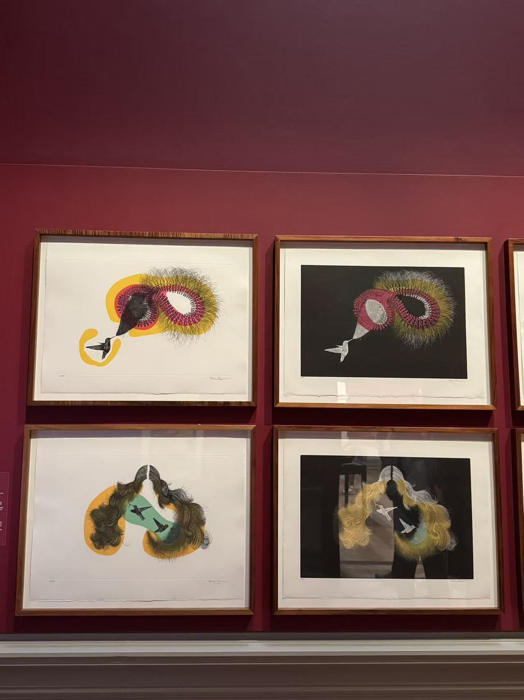
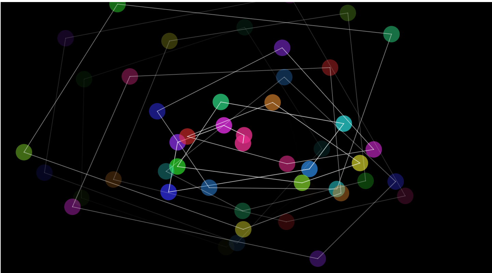

# Quiz 8

## Part 1 — Imaging Technique Inspiration
I am inspired by poetic and layered compositions seen in digital illustration and contemporary print art.  
The first image shows a moonlit pond with floating leaves forming a spiral, creating calm and depth.  
The second image, from the Art Gallery of New South Wales, uses overlapping textures and abstract hair-like lines to imply movement and emotion.  
I want to combine these elements to design an interactive scene that feels organic yet mysterious.  
This technique fits the assignment because it invites user exploration while conveying mood through flowing forms and layered transparency.

---

## Part 2 — Coding Technique Exploration

To recreate the flowing, layered look, I found a **connected particles** technique in p5.js.  
It uses classes and objects to generate colored nodes that link dynamically and fade over time, forming organic, web-like patterns.  
By adapting this method, I can build evolving lines and shapes that feel alive and echo the fluid spiral and hair-like textures in my inspiration images.  
This supports interactive visual storytelling without manually animating every element.

[Example Code Link — p5.js Connected Particles](https://p5js.org/examples/classes-and-objects-connected-particles/)

---